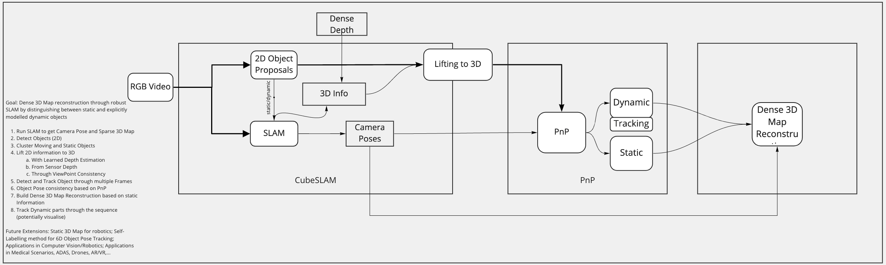

# AT3DCV: ObjectSLAM

This repository is an extension of [Shichao Yang's](https://shichaoy.github.io./) CubeSLAM implementation which in turn is based on **CubeSLAM: Monocular 3D Object SLAM**, IEEE Transactions on Robotics 2019, S. Yang, S. Scherer  [**PDF**](https://arxiv.org/abs/1806.00557).
It is the result of a collective effort by Ezgi Cakir, Andy Chen, and Leander Lauenburg during the cause of the practical course Advanced Topics of 3D computer vision. In addition to cleaning up, streamlining, and dockerizing CubeSLAM, we improved the work by adding dynamic object filtering, object class-dependent scaling, and embedding stream enrichments.

## Architecture for 3D dense map reconstruction




The project is written in C++ and based on ROS nodes. For a quick and easy installation we provide a Docker based setup as explained in the 'Quick Start' section.


## Quick Start
1. Download this repo: https://github.com/ct2034/docker-ubuntu-vnc-desktop
2. Change the Dockerfile with the Dockerfile uploaded here
3. Open terminal and go to the folder where the Dockerfile is located
4. sudo docker build -t at3dcv_2020 .
5. `docker run -it --rm -p 6080:80 -v ~/at3dcv/:/mnt/ at3dcv_2020:latest`
6. Browse to http://127.0.0.1:6080/
7. In the docker image open Terminal
8. cd cube_slam_ws
9.  `source /opt/ros/kinetic/setup.bash`
10. `catkin_make -j1`
11. `source devel/setup.bash`
12. `roslaunch orb_object_slam object_slam_example.launch > roslaunch.log`

## Start ROS
1. download the `ORBvoc.txt` file from the original ORB Slam 2 Vocabulary folder or from our now updated master branch.
2. copy the file to your Vocabulary folder with in the orb_object_slam folder with in your mounted objectslam folder.
3. download the whole `seq7` data folder from here: https://drive.google.com/drive/folders/1FrBdmYxrrM6XeBe_vIXCuBTfZeCMgApL
4. copy the `seq7` folder to a folder with in your mounted volume.
5. Edit the path of the parameter `base_data_folder` with in the mono.launch file to point to the `seq7` folder
6. Change `ORBvoc.bin` to `ORBvoc.txt` with in the mono.launch file (fifth line).
7. Open two terminals and in all three source the setup fill: `source <path_to_cu  be_slam>/devel/setup.bash`
8. Terminal one run: `roslaunch orb_object_slam xxxx.launch` and wait for two windows to pop up
9. Terminal two run: `rosbag play /mnt/datasets/freiburg3_walking_xyz/rgbd_dataset_freiburg3_walking_xyz.bag --clock -r 0.5 `


 ## Installation

 The project is written in C++ and based on ROS nodes. For a quick and easy installation we provide a Docker based setup

 ### Quick Start

1. Clone this[https://gitlab.lrz.de/ge39gol/objectslam] repo to \</your_path\>/cubeslam/src/objectslam/.
2. Clone the [Docker Ubuntu VNC repo](https://github.com/ct2034/docker-ubuntu-vnc-desktop).
3. Replace the Dockerfile in the Docker Ubuntu VNC repo with the docker file provided in this repo.
4. Open a terminal, navigate to the Docker Ubuntu VNC repo and run `sudo docker build -t at3dcv_2020`.
5. After the image is build, run `sudo docker run -it --rm -p 6080:80 -v </your_path>/cubeslam/src/objectslam/:/mnt/ at3dcv_2020:latest`.
6. Now open your browser and go to `http://127.0.0.1:6080/`.
7. Accessing the Ubuntu instance via your browser open a terminal and run:
	1. soure /opt/ros/kinetic/setup.bash
	2. cd /mnt/cubeslam/src
	3. run bash build.sh
	4. catkin_init_workspace
	5. source /mnt/cubeslam/devel/setup.bash
	6. echo "source /mnt/cubeslam/devel/setup.bash" >> ~/.bashrc

## Running the examples

1. Make sure that the `ORBvoc.txt` file is located in the `Vocabulary` folder of the `orb_object_slam` folder, with in your mounted `objectslam` folder. Should it not be present download the file from the orginal [ORB_SLAM2](https://github.com/raulmur/ORB_SLAM2/tree/master/Vocabulary) repo and place it into the mentioned folder.
2. Download [this](https://drive.google.com/file/d/15_6ugaKt5t7rSIzpFhDgqXrkb48qv3Mt/view?usp=sharing) data folder containing the bag-file, bounding boxes, edge detections and convex hulls and place it, on the same level as the folder `cubeslam`, in to a folder `Datasets`.
3. Open three terminals
4. In each terminal run
	1. `soure /opt/ros/kinetic/setup.bash`
	2. `source /mnt/cubeslam/devel/setup.bash``
5. Terminal one run: `roscore`
6. Terminal two run: `rosbag play - 0.5 <path-to-datafolder>/freiburg3_walking_xyz.bag /camera/rgb/image_color:=/kitti/left/image_raw`
7. Terminal tree run
	1. For mono: roslaunch `orb_object_slam tum_mono.launch`
	2. For RGB-D: roslaunch `orb_object_slam tum_rgbd.launch`

## The Data

The whole data collection can be found [here]https://drive.google.com/file/d/15_6ugaKt5t7rSIzpFhDgqXrkb48qv3Mt/view?usp=sharing.

### The Video Sequents 

One of the main contributions of this repo is the generalization of the original CubeSLAM repo to be used with an arbitrary data set. This means, that the original repo was largely hard coded for the use of the Kitti sequence `2011_09_30_drive_0027`.

For the example we choose the data set `freiburg3_walking_xyz`. We choose this set due to the challenging dynamic object, to test the robustness of the pipeline.
The data set can be found at the [Dataset Download](https://vision.in.tum.de/data/datasets/rgbd-dataset/download) side of the chair of Computer Vision at TUM. We use the provided ROS bag-file to feed the data to the pipeline. The bag-file is already included in the data collection.


### The Bounding Boxes and Edge Detections

One of the main contributions of the original Paper is a method for the proposal of 3D cuboids, based one bounding boxes and edges detected in each frame. However, the relevant code in the original repo is not used and instead the author provided a text file that holds the optimal 3D cuboids for the frames of the names Kitti sequence.
Therefore, we reversed engineered the format of the data needed for the calculation of the 3D cuboid proposals. We acquired the bounding boxes using Mask-RCNN and the edges using LSD edged detection. The bounding boxes as well as the detected edges are included in the data collection.

#### Format Bounding boxes

For each frame there is a file of the following format:

```
Object_class_obj_1 x_top_right_corner_obj_1 y_top_right_corner_obj_1 width_object_1 height_object_1 certainty_obj_1
Object_class_obj_2 x_top_right_corner_obj_2 y_top_right_corner_obj_2 width_object_2 height_object_2 certainty_obj_2
Object_class_obj_3 x_top_right_corner_obj_3 y_top_right_corner_obj_3 width_object_3 height_object_3 certainty_obj_3
...
```

#### Format Edges

For each frame there is a file of the following format:

```
x_0, y_0 ,x_1, y_1
x_0, y_0 ,x_1, y_1
````

Each row represents a single line.


### The Convex Hulls

Running the pipeline it became apparent that some cuboid proposals are quite off.
We there for extended the cost function for the cuboid proposals by an additional term. The additional therm ensures, that in -
1. 2D: The convex hulls of the instance segmentation mask provided by Mask-RCNN overlap with the 2D cuboid proposals.
2. 3D: The vortices of the convex hulls, lifted to 3D using the depth map, lie insight the 3D cuboid proposals (the 2D proposals lifted to 3D based on ray intersection with the ground).

In both cases the convex hulls where acquired using opencv while the instance segmentation where acquired using Mask-RCNN.
For each frame there exist a corresponding file containing the convex hulls of the detected segmentation masks. The format of the files is as follows:
```
x_1_obj_1, x_2_obj_1, x_3_obj_1, x_4_obj_1, x_5_obj_1, x_6_obj_1, x_7_obj_1, ..., x_n_obj_1
y_1_obj_1, y_2_obj_1, y_3_obj_1, y_4_obj_1, y_5_obj_1, x_6_obj_1, y_7_obj_1, ..., y_n_obj_1
x_1_obj_2, x_2_obj_2, x_3_obj_2, x_4_obj_2, x_5_obj_2, x_6_obj_2, x_7_obj_2, ..., x_n_obj_2
y_1_obj_2, y_2_obj_2, y_3_obj_2, y_4_obj_2, y_5_obj_2, x_6_obj_2, y_7_obj_2, ..., y_n_obj_2
...,	...,	...,	...,	...,	...,	...,	...,	...,	...,	...,
...,	...,	...,	...,	...,	...,	...,	...,	...,	...,	...,
x_1_obj_n, x_2_obj_n, x_3_obj_n, x_4_obj_n, x_5_obj_1n, x_6_obj_n, x_7_obj_n, ..., x_n_obj_n
y_1_obj_n, y_2_obj_n, y_3_obj_n, y_4_obj_n, y_5_obj_1n, x_6_obj_n, y_7_obj_n, ..., y_n_obj_n
```